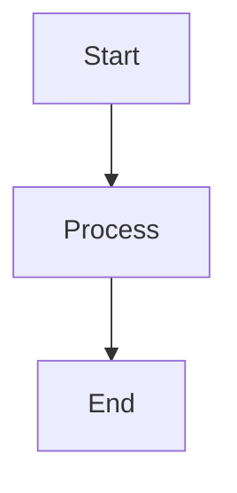
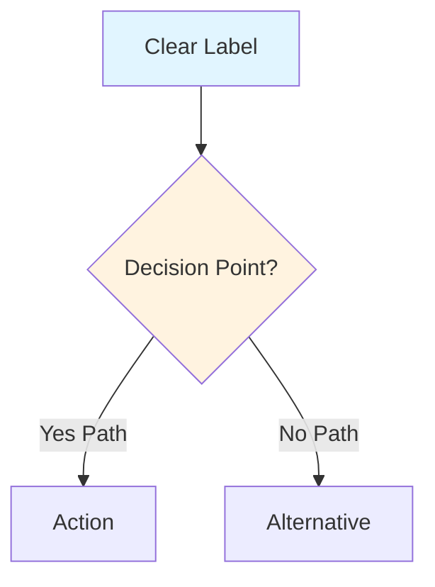
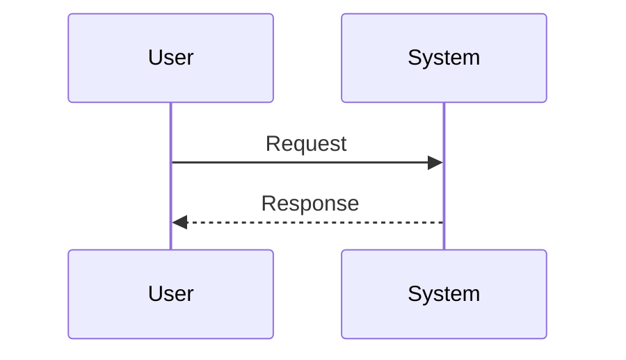
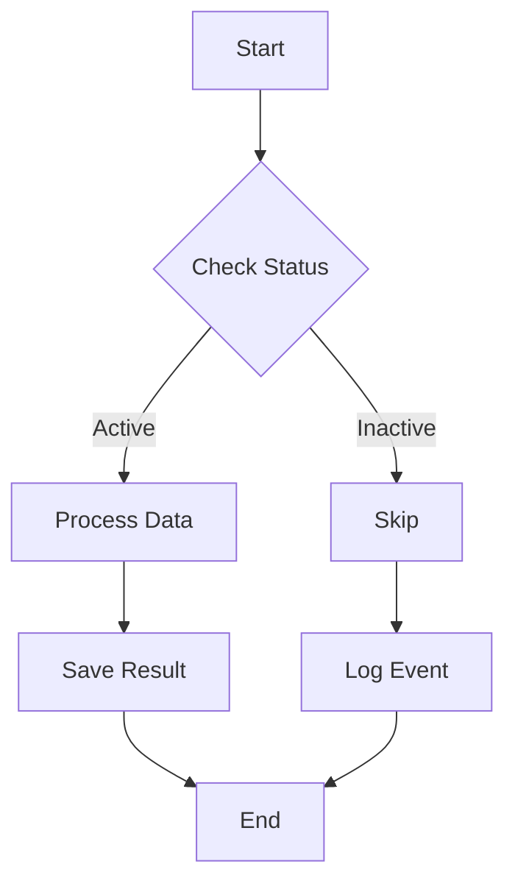

# Contributing to Diagramming Data Flows

Thank you for contributing! This guide will help you add and maintain Mermaid.js diagrams in this repository.

## Adding a New Diagram

### 1. Choose the Right Directory

- **diagrams/examples/**: Example diagrams for reference (generally don't modify)
- **diagrams/data-flows/**: Your custom data flow diagrams

### 2. Create Your Diagram File

Create a new Markdown (`.md`) file with a descriptive name:

```bash
# Example
touch diagrams/data-flows/payment-processing-flow.md
```

### 3. Add Diagram Content

Use this template:

````markdown
# [Descriptive Title]

Brief description of what this diagram shows.



## Description

Detailed explanation of the diagram components and flow.

### Key Components

- **Component A**: Description
- **Component B**: Description
````

### 4. Test Your Diagram

Before committing, verify your diagram:

1. **GitHub Preview**: If editing on GitHub, use the preview feature
2. **Local Preview**: Use VS Code with Mermaid extension
3. **Online Editor**: Paste your code into [mermaid.live](https://mermaid.live/)

### 5. Commit Your Changes

```bash
git add diagrams/data-flows/your-diagram.md
git commit -m "Add diagram: [brief description]"
git push
```

## Diagram Guidelines

### Style Guidelines

- Use clear, descriptive node labels
- Keep diagrams focused on a single concept or flow
- Add explanatory text below complex diagrams
- Use consistent naming conventions

### Flowchart Best Practices



**Tips:**
- Use square brackets `[]` for processes
- Use curly braces `{}` for decisions
- Use parentheses `()` for rounded nodes
- Add styling for emphasis (optional)

### Sequence Diagram Best Practices



**Tips:**
- Use meaningful participant aliases
- Keep the sequence focused
- Add notes for clarifications using `Note`

## Common Mermaid Syntax

### Flowchart Directions

- `graph TD`: Top to bottom
- `graph LR`: Left to right
- `graph BT`: Bottom to top
- `graph RL`: Right to left

### Node Shapes

- `[Text]`: Rectangle (process)
- `(Text)`: Rounded rectangle
- `{Text}`: Diamond (decision)
- `((Text))`: Circle
- `[/Text/]`: Parallelogram
- `[\Text\]`: Alt parallelogram

### Arrow Types

- `-->`: Solid arrow
- `-.->`: Dotted arrow
- `==>`: Thick arrow
- `-- Text -->`: Arrow with label

### Example: Full Flowchart



## Need Help?

- Check the [examples directory](diagrams/examples/) for inspiration
- Visit [Mermaid documentation](https://mermaid.js.org/)
- Try the [Mermaid Live Editor](https://mermaid.live/)
- Open an issue if you have questions

## Review Process

1. Ensure diagram renders correctly
2. Check that file follows naming conventions
3. Verify documentation is included
4. Submit a pull request (if applicable)

Thank you for contributing! 🎉
