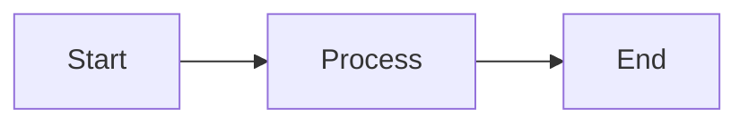
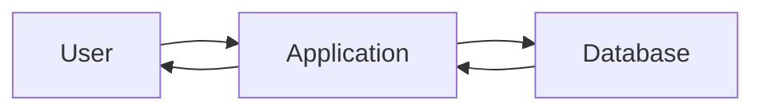
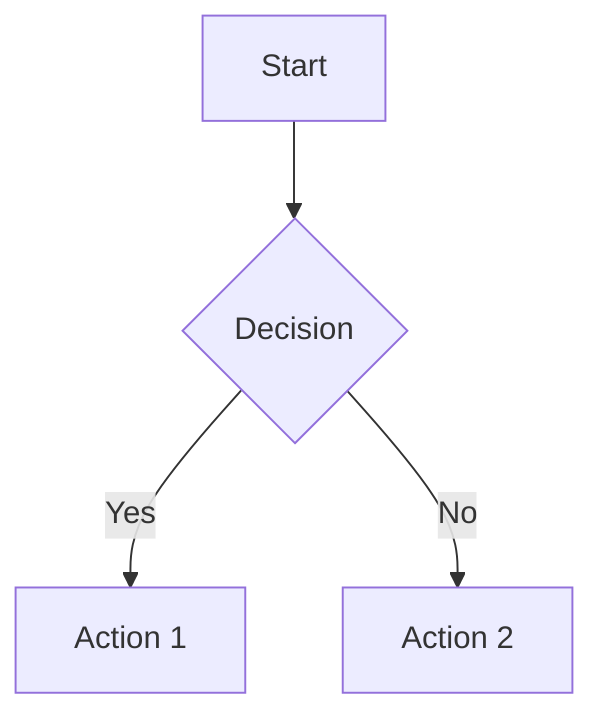
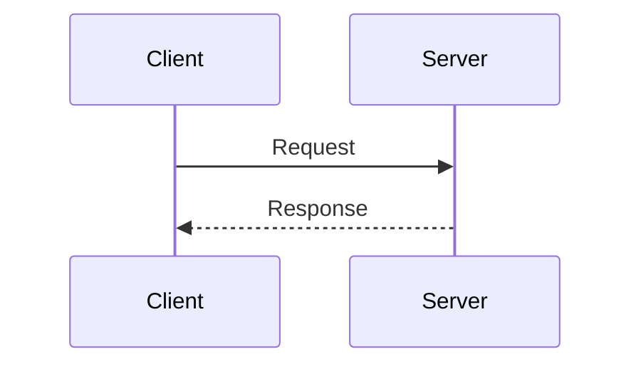
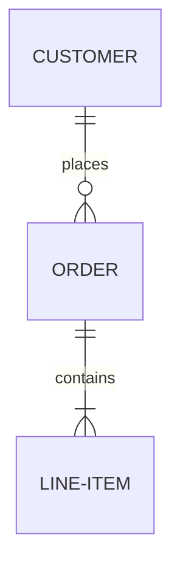

# Diagramming Data Flows

A repository for creating and maintaining data flow diagrams using Mermaid.js. This repository provides a structured approach to documenting system architectures, data pipelines, and process flows using diagrams-as-code.

## 📊 About Mermaid.js

[Mermaid](https://mermaid.js.org/) is a JavaScript-based diagramming tool that renders Markdown-inspired text definitions to create and modify diagrams dynamically. It allows you to create diagrams and visualizations using a simple, text-based syntax.

### Why Mermaid?

- **Version Control Friendly**: Diagrams are plain text, making them easy to track in Git
- **No Special Tools Required**: View diagrams directly on GitHub
- **Easy to Update**: Modify diagrams by editing text
- **Consistent Style**: Automatic layout and styling
- **Multiple Diagram Types**: Flowcharts, sequence diagrams, Gantt charts, and more

## 🚀 Quick Start

### Viewing Diagrams

All diagrams in this repository render automatically when viewing `.md` files on GitHub. Simply navigate to any diagram file in the `diagrams/` directory.

### Creating a New Diagram

1. Navigate to the appropriate directory in `diagrams/`
2. Create a new `.md` file
3. Add your diagram using Mermaid syntax:

````markdown

````

4. Commit and push your changes

### Example: Simple Data Flow



## 📁 Repository Structure

```
.
├── diagrams/
│   ├── README.md           # Diagram documentation
│   ├── examples/           # Example diagrams
│   └── data-flows/         # Custom data flow diagrams
└── README.md               # This file
```

## 🎨 Diagram Types Supported

### Flowcharts
Used for data flows, processes, and decision trees.



### Sequence Diagrams
Show interactions between components over time.



### Entity Relationship Diagrams
Document database schemas and relationships.



## 🛠️ Tools and Resources

### Viewing Tools
- **GitHub**: Native support for Mermaid in Markdown files
- **VS Code**: Install "Markdown Preview Mermaid Support" extension
- **Mermaid Live Editor**: [mermaid.live](https://mermaid.live/) - Online editor with real-time preview
- **IntelliJ/WebStorm**: Built-in Mermaid support in Markdown preview

### CLI Tool (Optional)
For generating images from Mermaid diagrams:

```bash
npm install -g @mermaid-js/mermaid-cli
mmdc -i diagram.md -o diagram.png
```

## 📚 Learning Resources

- [Official Mermaid Documentation](https://mermaid.js.org/)
- [Mermaid Syntax Guide](https://mermaid.js.org/intro/syntax-reference.html)
- [GitHub's Mermaid Support Announcement](https://github.blog/2022-02-14-include-diagrams-markdown-files-mermaid/)
- [Mermaid Cheat Sheet](https://jojozhuang.github.io/tutorial/mermaid-cheat-sheet/)

## 🤝 Contributing

1. Create diagrams in the appropriate directory under `diagrams/`
2. Use descriptive file names (e.g., `user-authentication-flow.md`)
3. Include a description of your diagram in the markdown file
4. Follow the examples in `diagrams/examples/` for formatting

## 📋 Best Practices

- **Keep it Simple**: Start with simple diagrams and add complexity as needed
- **Add Descriptions**: Include context and explanations with your diagrams
- **Use Meaningful Labels**: Make node labels clear and descriptive
- **Organize by Topic**: Group related diagrams in subdirectories
- **Version Control**: Commit diagrams with meaningful commit messages

## 📄 License

This repository is for documenting data flows and system architectures. Check the repository settings for license information.

## 📞 Support

For issues with Mermaid syntax, refer to the [official documentation](https://mermaid.js.org/).
For repository-specific questions, please open an issue.