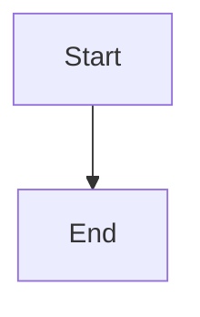

# Data Flows

This directory is for your custom data flow diagrams.

## Getting Started

Create new diagram files here following the examples in the `examples/` directory.

### Naming Convention

Use descriptive names for your diagram files:
- `system-architecture.md`
- `user-authentication-flow.md`
- `data-processing-pipeline.md`
- `api-request-flow.md`

### Template

````markdown
# [Diagram Title]

Brief description of what this diagram represents.



## Details

Add any additional context, explanations, or notes about the diagram here.
````
