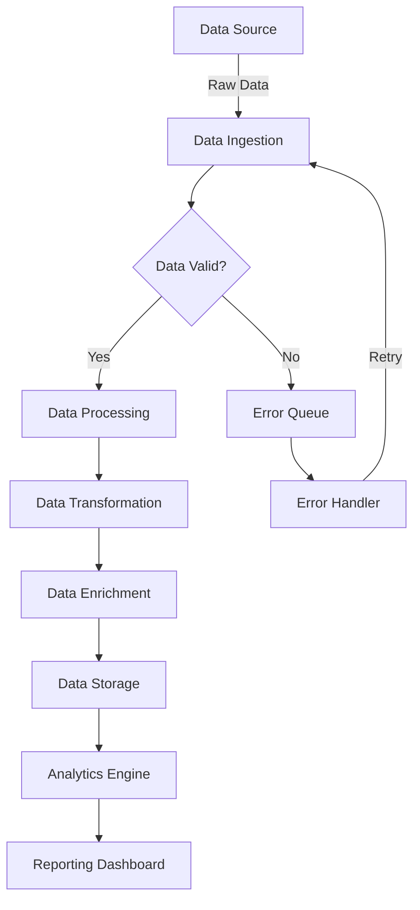

# Complex Data Pipeline Example

This diagram illustrates a more complex data processing pipeline.

## Pipeline Stages

1. **Data Ingestion**: Collects data from various sources
2. **Validation**: Checks data quality and format
3. **Processing**: Cleans and prepares data
4. **Transformation**: Converts data to target format
5. **Enrichment**: Adds additional context and metadata
6. **Storage**: Persists processed data
7. **Analytics**: Analyzes stored data
8. **Reporting**: Presents insights through dashboards

## Error Handling

Failed data is sent to an error queue, processed by an error handler, and can be retried through the pipeline.
