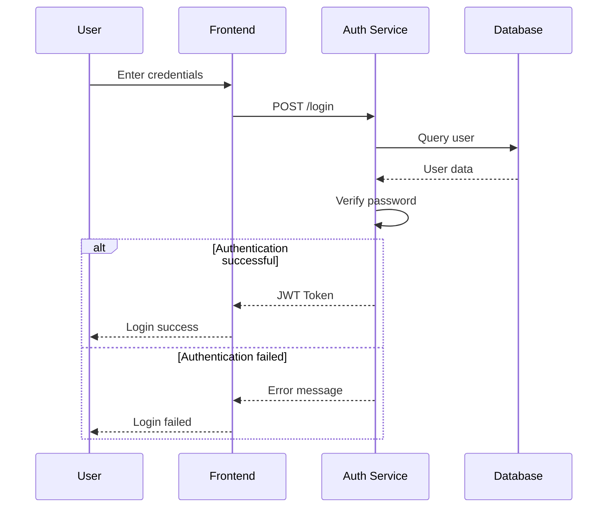

# Sequence Diagram Example

This diagram shows the sequence of interactions in a user authentication flow.

## Authentication Flow

1. User enters credentials in the frontend
2. Frontend sends login request to auth service
3. Auth service queries database for user
4. Password verification is performed
5. On success, JWT token is returned
6. On failure, error message is shown
