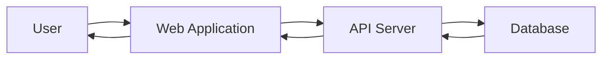

# Simple Data Flow Example

This diagram shows a basic data flow from a user to a database.

## Diagram Description

- **User**: Initiates a request through the web interface
- **Web Application**: Frontend application that handles user interactions
- **API Server**: Backend service that processes requests
- **Database**: Stores and retrieves data

## How to View

This diagram will render automatically in GitHub's markdown viewer, or you can use:
- [Mermaid Live Editor](https://mermaid.live/)
- VS Code with Mermaid extension
- Any Markdown viewer that supports Mermaid
